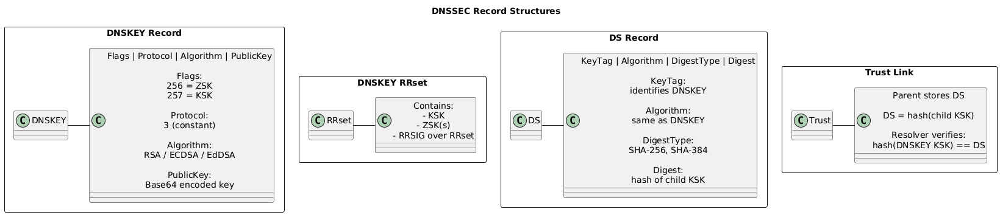
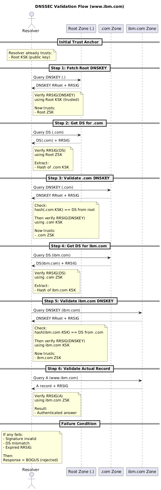

# DNSSEC

> DNSSEC (Domain Name System Security Extensions) is a set of protocol extensions to DNS that uses public-key cryptography and digital signatures to enable resolvers to cryptographically verify the authenticity and integrity of DNS data, establishing a chain of trust from a configured trust anchor (root) down to the queried domain.

## Cryptographic guarantees of DNSSEC

1. **Data Integrity**
   Ensures DNS records are not modified in transit using digital signatures (RRSIG).

2. **Data Origin Authentication**
   Confirms that DNS data is published by the legitimate authoritative zone via verified public keys.

3. **Authenticated Denial of Existence**
   Provides proof that a domain or record does not exist using signed NSEC/NSEC3 records.

4. **Chain of Trust**
   Establishes trust from the root to the queried domain using DS and DNSKEY validation at each level.

---

## What DNSSEC does NOT provide

* No confidentiality (no encryption of DNS data)
* No protection against availability attacks (e.g., DDoS)
* No client/server identity verification (unlike TLS)

> fig. DNSKEY RRSET and DS Records

> fig. Workflow of resolving www.ibm.com
## Clearly Explained
https://chatgpt.com/c/697426d8-b91c-8321-9ae1-2ce56282d8d1

Good, this is the _right_ place to slow everything down. I’ll rewrite the whole flow in a **deliberately explicit, almost mechanical way**, repeating ownership even if it feels redundant. That repetition is what removes confusion.

First, your **rephrased request** (cleaner):

> “Explain the DNSSEC validation steps in detail, explicitly stating at each level which zone owns which keys and records, and which private key is used to sign what, so the trust chain becomes unambiguous.”

Now the explanation.

---

## :sd

### Global starting point (before any query)

The **resolver** already has **one single trust anchor**:

- **Root zone (.) KSK public key**
    
- This is hardcoded in the resolver software
    

This is the _only_ key the resolver trusts without verification.

---

### Step 1: Root zone (.)

**Owner:** Root DNS zone  
**Resolver already trusts:** Root **KSK public key**

**Root owns:**

- Root **KSK key pair**
    
- Root **ZSK key pair**
    
- Root **DNSKEY RRset** (contains root KSK public + root ZSK public)
    
- Root **DS records for TLDs** (like .com)
    

**What happens:**

1. Resolver fetches **root DNSKEY RRset**
    
2. Resolver verifies `RRSIG(DNSKEY)`
    
    - Signed by **root KSK private key**
        
    - Verified using **root KSK public key (trusted anchor)**
        
3. Now the resolver trusts **root ZSK public key**
    

At this point:

- Root DNSKEY RRset is trusted
    
- Root ZSK is trusted
    

---

### Step 2: Delegation from root to `.com`

**Owner of DS record:** Root zone  
**Owner of keys:** `.com` zone

**Root provides:**

- **DS record for `.com`**
    
- DS contains **hash of .com KSK public key**
    
- DS is signed with **root ZSK private key**
    

**Resolver actions:**

1. Resolver verifies `RRSIG(DS for .com)`
    
    - Uses **root ZSK public key**
        
2. Resolver extracts the **hash of .com KSK** from DS
    

Now the resolver has:

- A trusted fingerprint of **.com KSK public key**
    

---

### Step 3: `.com` zone validation

**Owner:** `.com` DNS zone

**.com owns:**

- `.com` KSK key pair
    
- `.com` ZSK key pair
    
- `.com` DNSKEY RRset
    
- `.com` DS records for child zones (like ibm.com)
    

**What happens:**

1. Resolver fetches **.com DNSKEY RRset**
    
2. Resolver checks:
    
    - Does hash(.com KSK public key) == DS from root?
        
3. If match succeeds:
    
    - `.com KSK public key` is now trusted
        
4. Resolver verifies `RRSIG(DNSKEY)`
    
    - Signed by **.com KSK private key**
        
    - Verified using **.com KSK public key**
        
5. Now the resolver trusts **.com ZSK public key**
    

---

### Step 4: Delegation from `.com` to `ibm.com`

**Owner of DS record:** `.com` zone  
**Owner of keys:** `ibm.com` zone

**.com provides:**

- **DS record for ibm.com**
    
- DS contains **hash of ibm.com KSK public key**
    
- DS is signed with **.com ZSK private key**
    

**Resolver actions:**

1. Resolver verifies `RRSIG(DS for ibm.com)`
    
    - Uses **.com ZSK public key**
        
2. Resolver extracts hash of **ibm.com KSK public key**
    

Now the resolver has:

- A trusted fingerprint of **ibm.com KSK**
    

---

### Step 5: `ibm.com` zone validation

**Owner:** `ibm.com` DNS zone

**ibm.com owns:**

- `ibm.com` KSK key pair
    
- `ibm.com` ZSK key pair
    
- `ibm.com` DNSKEY RRset
    
- All RRsets inside ibm.com (A, MX, TXT, etc.)
    

**What happens:**

1. Resolver fetches **ibm.com DNSKEY RRset**
    
2. Resolver checks:
    
    - Does hash(ibm.com KSK public key) == DS from `.com`?
        
3. If match succeeds:
    
    - ibm.com KSK public key is trusted
        
4. Resolver verifies `RRSIG(DNSKEY)`
    
    - Signed by **ibm.com KSK private key**
        
    - Verified using **ibm.com KSK public key**
        
5. Now the resolver trusts **ibm.com ZSK public key**
    

---

### Step 6: Actual DNS answer verification

**Owner:** `ibm.com` zone

**ibm.com provides:**

- `www.ibm.com A 9.9.9.9` (example)
    
- Corresponding **RRSIG(A)**
    

**Resolver actions:**

1. Resolver verifies `RRSIG(A)`
    
    - Signed by **ibm.com ZSK private key**
        
    - Verified using **ibm.com ZSK public key**
        

If valid:

- DNS answer is authentic
    
- Data integrity and origin authentication are confirmed
    

---

### Final failure condition

If **any** of these fail:

- Signature mismatch
    
- Hash mismatch
    
- Missing DS
    
- Expired RRSIG
    

Then:

- Resolver marks the response as **bogus**
    
- Client does not accept the answer
    

---

## :da

At every DNSSEC step, **the zone that owns the data signs it with its own private key**, and **the parent zone vouches for the child’s KSK by publishing and signing a DS record**.

If you want, next we can:

- Collapse this into **one single verification table**
    
- Or trace a real `dig +dnssec www.ibm.com` output line by line
    
- Or redraw this as a strict PKI comparison (CA, cert, chain)
    

Now you’re one alignment away from it fully clicking.