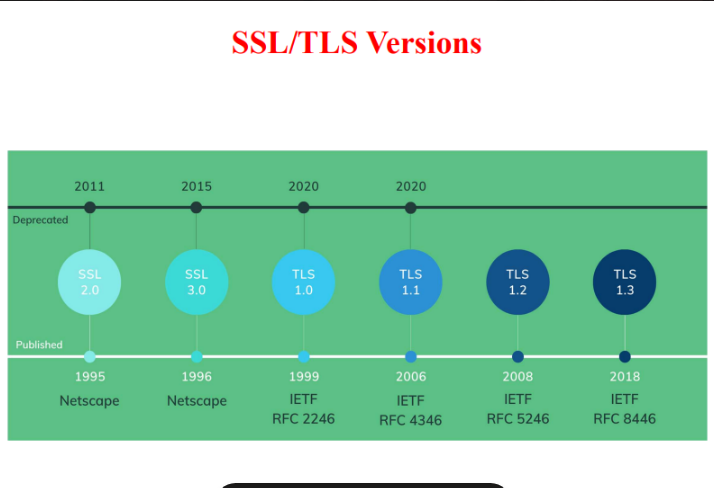
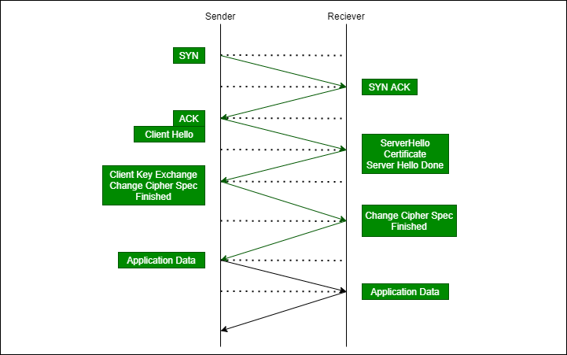
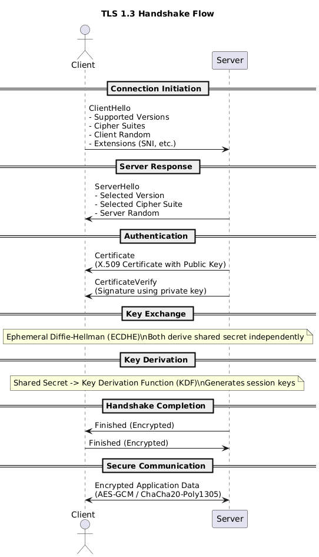

# Transport Layer Security (TLS)

- SSL/TLS versions

- Change cipher spec flow is for tls 1.2 and less. In TLS1.3 that is obsolete

- Flow of TLSV1.3

---

**Rephrased question:**
“Teach me the complete TLS handshake flow clearly, including all steps and what happens internally.”

---

## :sd TLS Flow (Handshake + Data Phase)

TLS (Transport Layer Security) is a **cryptographic protocol** that establishes a **confidential, integrity-protected, and authenticated channel** over an insecure network.

Think of it as:
“Before talking securely, both sides negotiate rules, verify identity, and derive shared secrets.”

---

# 1. High-level intuition (mental model)

* Client → “I want secure communication”
* Server → “Here’s my identity (certificate)”
* Both → “Let’s agree on keys securely”
* After that → “All communication is encrypted”

---

# 2. TLS Handshake Flow (modern TLS 1.3)

### Step-by-step (precise but digestible)

---

### 1. ClientHello

Client initiates connection.

**Contains:**

* Supported TLS versions
* Cipher suites (crypto algorithms)
* Random number (client_random)
* Extensions (like SNI = which domain you want)

**Key idea:**
Client proposes capabilities.

---

### 2. ServerHello

Server responds.

**Contains:**

* Selected TLS version
* Selected cipher suite
* Server random

**Key idea:**
Server chooses the cryptographic parameters.

---

### 3. Server sends Certificate

* X.509 certificate (contains public key)
* Signed by a Certificate Authority (CA)

**Purpose:**
Authentication
Client verifies:

* Is this certificate valid?
* Is it signed by trusted CA?
* Does domain match?

---

### 4. Key Exchange (Diffie-Hellman)

This is the **core cryptographic step**.

Both sides generate a **shared secret** using:

* Ephemeral keys (ECDHE usually)
* No direct transmission of secret

👉 This ensures **forward secrecy**

---

### 5. Finished Messages

Both sides:

* Derive session keys from shared secret
* Send “Finished” messages (encrypted)

**Meaning:**
“If you can decrypt this, handshake succeeded.”

---

# 3. Key Derivation (important concept)

From shared secret → derive:

* Encryption key
* MAC key (integrity)
* IVs (initialization vectors)

Using a **Key Derivation Function (KDF)**

---

# 4. Secure Data Transfer Phase

Now TLS switches to:

* Symmetric encryption (fast)
* Example:

  * AES-GCM
  * ChaCha20-Poly1305

All application data (HTTP, etc.) is encrypted.

---

# 5. Important Security Properties

### 1. Confidentiality

No one can read data

### 2. Integrity

No tampering (MAC / AEAD)

### 3. Authentication

Server identity verified via certificate

### 4. Forward Secrecy

Even if server key leaks later, past sessions stay safe

---

# 6. TLS 1.2 vs TLS 1.3 (quick contrast)

| Feature           | TLS 1.2     | TLS 1.3            |
| ----------------- | ----------- | ------------------ |
| Handshake RTT     | 2           | 1                  |
| Key exchange      | Optional DH | Mandatory (ECDHE)  |
| Security          | Good        | Stronger + simpler |
| Deprecated crypto | Allowed     | Removed            |

---

# 7. Vocabulary upgrade (use these words)

* **Ephemeral** → short-lived (used for temporary keys)
* **Cipher suite** → bundle of crypto algorithms
* **Handshake** → negotiation phase before secure communication
* **Forward secrecy** → past sessions remain safe even if keys leak
* **Authenticated encryption** → encryption + integrity together

---

# 8. One-line interview answer

:ol
TLS is a protocol that uses a handshake to authenticate the server, negotiate cryptographic parameters, and establish shared session keys for secure communication.

---

If you want next level clarity, I can:

* simulate a real TLS handshake with actual values
* map this flow to HTTPS packets in Wireshark
* or compare TLS vs IPSec deeply (since you asked IPSec earlier)
