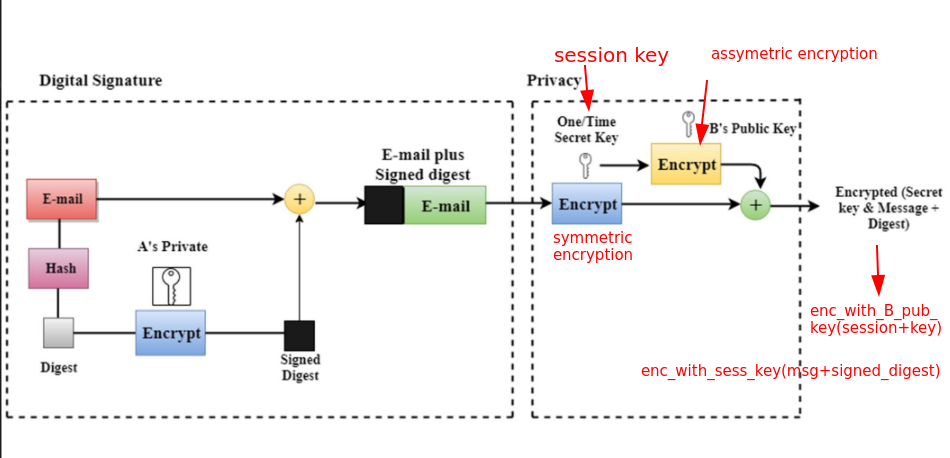
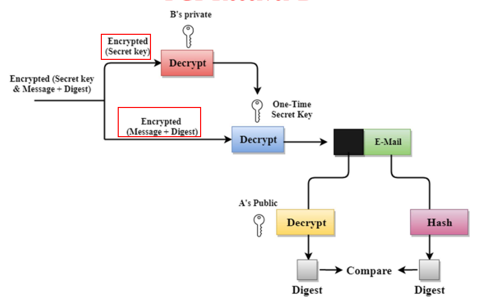

# PGP - OpenPGP - GnuGPG


> OpenPGP is an open standard that defines interoperable formats and protocols for encrypting, signing, and managing cryptographic keys using hybrid encryption to enable secure end-to-end communication.

**Sender**



**Receiver**



**Rephrased question:**
“Give me a complete, structured, exam-ready note on OpenPGP covering its origin, motivation, architecture, flow, components, and practical relevance.”


---

# 📘 OpenPGP — Complete Master Note

## 1. Origin and Evolution

* **PGP (Pretty Good Privacy)** was created in 1991 by Phil Zimmermann
* Goal: enable **strong cryptography for individuals**, especially email privacy
* Became controversial due to:

  * export restrictions (crypto classified as munition)
  * proprietary licensing

👉 This led to the creation of **OpenPGP**

* Standardized by **IETF** as:

  * **RFC 4880** (core OpenPGP standard)

---

## 2. Why OpenPGP was needed

Before OpenPGP:

* Email (SMTP) = **plaintext**
* TLS = **hop-to-hop security only**
* No:

  * end-to-end encryption
  * identity assurance
  * persistent confidentiality

### Problem Statement

> “How can two users securely communicate over an untrusted network *without relying on centralized authorities*?”

---

## 3. Core Design Philosophy

OpenPGP is based on:

### 1. Hybrid Cryptography

* Symmetric (AES) → for speed
* Asymmetric (RSA, ECC) → for key exchange

### 2. Decentralized Trust

* No CA like TLS
* Uses **Web of Trust**

### 3. Data-centric Security

* Protects the **message itself**, not the channel

---

## 4. Key Concepts (must-know)

### 4.1 Key Pair

Each user has:

* Public key → shared
* Private key → secret

---

### 4.2 Session Key (critical concept)

* Random symmetric key generated per message
* Used to encrypt actual data

> You never see it — tools generate it automatically

---

### 4.3 ASCII Armor

Binary data converted into:

```text
-----BEGIN PGP MESSAGE-----
```

👉 Makes it email-safe

---

### 4.4 Keyring

* Local database of keys
* Stores:

  * your keys
  * others’ public keys

---

## 5. Full Encryption Flow (step-by-step)

### Sender (Alice → Bob)

#### Step 1: Generate session key

* Random symmetric key

#### Step 2: Encrypt message

* Using session key (AES)

#### Step 3: Encrypt session key

* Using Bob’s public key (RSA)

#### Step 4: Package into OpenPGP format

Contains:

* encrypted session key
* encrypted message
* metadata

#### Step 5: Send

---

### Receiver (Bob)

#### Step 1: Decrypt session key

* Using Bob’s private key

#### Step 2: Decrypt message

* Using session key

---

## 6. Digital Signatures (authenticity)

### Signing Flow

1. Hash message (SHA-256, etc.)
2. Encrypt hash using sender’s private key
3. Attach signature

---

### Verification Flow

1. Decrypt signature using sender’s public key
2. Compare hashes

---

## 7. Packet Structure (important insight)

OpenPGP is **packet-based**

Main packet types:

* Public-Key Encrypted Session Key Packet
* Symmetric Encrypted Data Packet
* Signature Packet
* Literal Data Packet

👉 This is what ensures interoperability

---

## 8. What OpenPGP Standardizes

This is the **core answer to your doubt**

OpenPGP defines:

### 1. Message Format

* Exact structure of encrypted messages

### 2. Encryption Workflow

* How session keys are generated and used

### 3. Signature Format

* What gets signed and how

### 4. Key Format

* Public/private key structure
* Fingerprints, IDs

### 5. Key Lifecycle

* Expiry
* Revocation
* Subkeys

### 6. Multi-recipient Handling

* Same message encrypted for multiple users

---

## 9. Web of Trust (critical difference from TLS)

### TLS:

* Centralized (Certificate Authorities)

### OpenPGP:

* Decentralized

Users:

* Sign each other’s keys
* Build trust networks

---

### Problem

* Hard to scale
* Confusing for users

---

## 10. OpenPGP vs TLS

| Aspect        | OpenPGP      | TLS           |
| ------------- | ------------ | ------------- |
| Security type | Data-level   | Channel-level |
| Trust model   | Web of Trust | PKI           |
| Mode          | Asynchronous | Real-time     |
| Persistence   | Yes          | No            |

---

## 11. Real-world Use Cases

* Email encryption
* File encryption
* Software signing (Linux packages, ISOs)
* Git commit signing
* Secure backups

---

## 12. Advantages

### 1. End-to-end encryption

* Only sender & receiver can read

### 2. No central authority

* Fully decentralized

### 3. Persistent security

* Data remains encrypted forever

### 4. Interoperability

* Works across tools

---

## 13. Limitations (important for exams)

### 1. Key management is hard

* Users don’t verify keys properly

### 2. Poor usability

* High cognitive load

### 3. Metadata leakage

* Subject, sender visible

### 4. Web of Trust doesn’t scale well

---

## 14. Why not just use AES + MD5 manually?

Because OpenPGP provides:

* Standard structure
* Secure defaults
* Interoperability
* Identity management
* Lifecycle handling

Your DIY system:

* breaks easily
* lacks compatibility
* is insecure in subtle ways

---

## 15. Modern Relevance

OpenPGP is:

* Still used in:

  * DevOps
  * package signing
  * privacy-focused email

But replaced in messaging by:

* Signal Protocol
* WhatsApp E2EE

👉 Reason:

* Better usability
* Automated key management

---

## 16. Strong conceptual summary

> OpenPGP is not a new cryptographic algorithm.
> It is a **complete protocol that orchestrates encryption, signing, key management, and trust into a standardized, interoperable system for secure communication.**

---

## Vocabulary boost

* **Orchestrate** → coordinate multiple components effectively
* **Interoperable** → compatible across systems
* **Encapsulation** → wrapping data securely
* **Decentralized trust** → no single authority controls verification

**Example sentence:**
“OpenPGP orchestrates multiple cryptographic primitives into a cohesive and interoperable framework for secure communication.”

---

## :sd (Short description)

OpenPGP emerged from the need to provide strong, end-to-end encryption in a decentralized manner without relying on centralized authorities. Instead of introducing new cryptographic algorithms, it standardizes how existing primitives like symmetric and asymmetric encryption are combined, packaged, and used across systems. Its hybrid encryption model uses session keys for efficiency and public-key cryptography for secure key exchange, while its Web of Trust model handles identity verification. Despite its robustness and flexibility, OpenPGP suffers from usability and key management challenges, leading to reduced adoption in modern messaging systems, though it remains highly relevant in software signing and secure data exchange.

---

If you want to go one level deeper, the most powerful next step would be:

* **decode a real `.gpg` file byte-by-byte (packet dissection)**
* or compare **OpenPGP vs Signal protocol at architecture level (this is elite understanding)**
