## 1. **High-Level Application Design**

The high-level application structure for your Class Management System using Next.js includes three main layers: the Client Layer, API Layer, and Database Layer. The frontend (Next.js) will interface with an Express.js backend, which interacts with MongoDB as the database. Authentication and authorization will be managed by JSON Web Tokens (JWT), with file storage handled by an external service like AWS S3 or Google Cloud Storage.

### Layers Overview

- **Client Layer (Next.js Frontend)**: The user-facing interface where students, CRs, CAs, Admins, and Super Admins interact with the application.
- **API Layer (Express.js Backend)**: Handles requests from the frontend, routes them to the appropriate services, and manages authentication and authorization.
- **Database Layer (MongoDB)**: Stores data for users, classes, notices, attendance, materials, and other application entities.

---


## Big Picture

![Diagram](https://www.plantuml.com/plantuml/png/dLHDKzj03BtxLsZS0-50S-YjXmuXnXqwG9c4ZxDY2yTbivlkoWMcq__UrMmsTcpSJik9F3rfzPuidJf6oyr69Uwfrbkqk05B1QEk5C7F1FpV6HPFbJMDBkT66GlliYpFiop4Z2t91dobF55Go8tcBlQhKxrGfYd7AalT_wvS8kCAtH_QbiR_gNY21VkVTuuie8CcILfpqhcgIJDSugkFJgxfXTz_SyVfxlcME6juVOCLzU0CtNfbq9Oz_DfmNT1RaNJ9JKdoPEquxGTdpAHBr0N1hVNjanrGxdrfNKrpedBb6ODuNYk2AzHOqOOqf-90zuMRYwZs_6LhoRbnmPxRGyN48HhK3l5MpJ0MP0nnQLzGt_N-MqYp-D-kyokZAvETxTlUCwK_vyUlVBtQwCFWNA5pD1AEAaR3LyXaQrIZX5Rj62DeRgCYCgnIUlx2P3KgM9Bz8Mr4QRlux649omym4NjWoSPYHSTfbv7NbkGLcDmqRWsYvh4kKDvnXyml3xSmaVcIvXt34tmlHv1ReqK5i07vKch_os8X59SqS7BoQRy9y14kJGKNEk3jAlZ0hF0A72oCeXFfgOISa1jBiKZmEjBlQteEK2JqrYHoP89IrZ7PI1okp9xU2SqKMOx51pia2OPfkcnMcveXue4-M2cXtssLmNAQcMSj_u1GN994SoGlhf1dByLIxrQjOK7V6tASj7O9DUoLK7FYOXsEbNpri7eL6odfEjOw67BcYxjixr_FkRUgTnd9cmPALejtSriq6TeeQG7SDOQE1I0ti7PegYGB65939Ffw18AoWNW93h_Cw7GKszbH6IsgkaIcuEhSaeYNJKu46CkBBRIpsCqW9WpkHPp4rorP38qTUDXpjPiOdE-QszhOcdgG8KU0TkRkNHMxOixmO4dQWXx9aWmx380OvJw9nVqR11SZ7e-S45_zCsdHJjDxilNZAzoQ9zBThaOksVXATKRqjniN5-q0Jauzr6pKRm00)

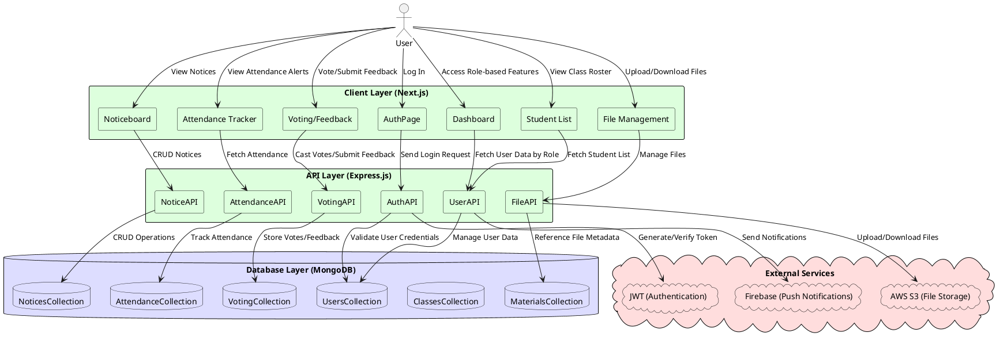


### High-Level Mermaid Diagram

```mermaid
flowchart TD
    subgraph ClientLayer [Client Layer - Next.js Frontend]
        A1[Auth Page]
        A2[Dashboard]
        A3[Noticeboard]
        A4[Student List]
        A5[Attendance Tracker]
        A6[Voting Poll]
        A7[Feedback Page]
    end

    subgraph APILayer [API Layer - Node.js + Express Backend]
        B1[Auth API]
        B2[User Management API]
        B3[Class/Notice API]
        B4[File API]
        B5[Attendance API]
        B6[Voting/Feedback API]
    end

    subgraph DatabaseLayer [Database Layer - MongoDB]
        C1[Users Collection]
        C2[Classes Collection]
        C3[Notices Collection]
        C4[Materials Collection]
        C5[Attendance Collection]
        C6[Events Collection]
    end

    subgraph ExternalServices [External Services]
        D1[GCS / AWS S3 (File Storage)]
        D2[Firebase Messaging (Push Notifications)]
        D3[JWT (Authentication)]
    end

    ClientLayer -->|HTTP Requests| APILayer
    APILayer --> DatabaseLayer
    APILayer --> ExternalServices
```

---

## 2. **Detailed Component Overview**

For each component in the Client Layer and API Layer, I’ll break down the structure and interaction logic, followed by a specific Mermaid diagram.

---

### **Client Layer Components**

#### a. **Authentication Component**

**Purpose**: Allows users to log in and access features based on their roles. Uses JWT for session management.

**Features**:
- Login Form
- Sign-up Form (if needed)
- JWT-based session handling and redirection

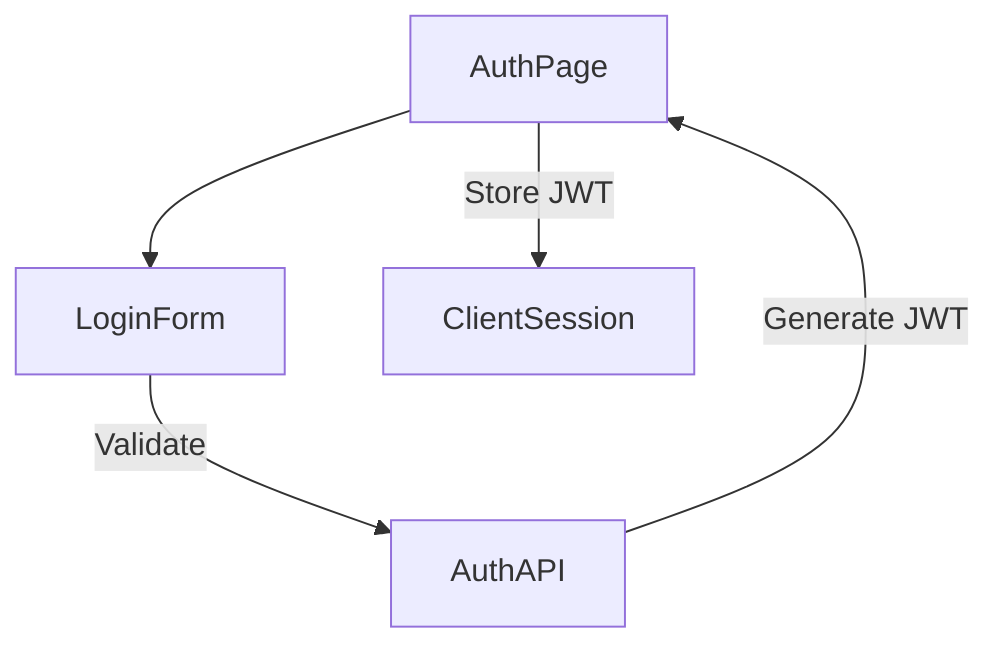

---

#### b. **Dashboard Component**

**Purpose**: Role-based dashboard that provides tailored access to features.

**Features**:
- Student, CR, CA, Admin, and Super Admin Views
- Role-based navigation

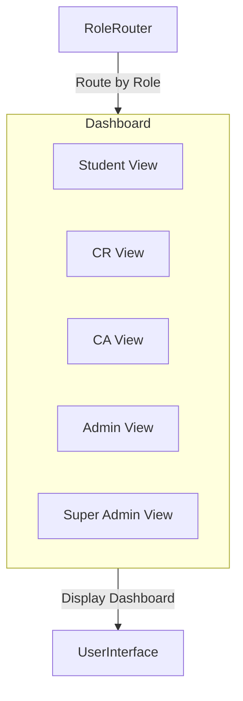

---

#### c. **Noticeboard Component**

**Purpose**: A space for posting and viewing notices.

**Features**:
- CRUD operations for notices
- Display for class-specific announcements

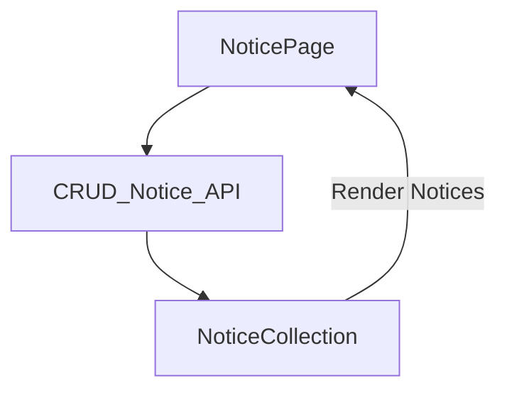

---

#### d. **Voting and Feedback Components**

**Purpose**: Enable voting on class-related polls and collecting feedback from students.

**Features**:
- Create Polls
- Cast Votes
- Submit Feedback

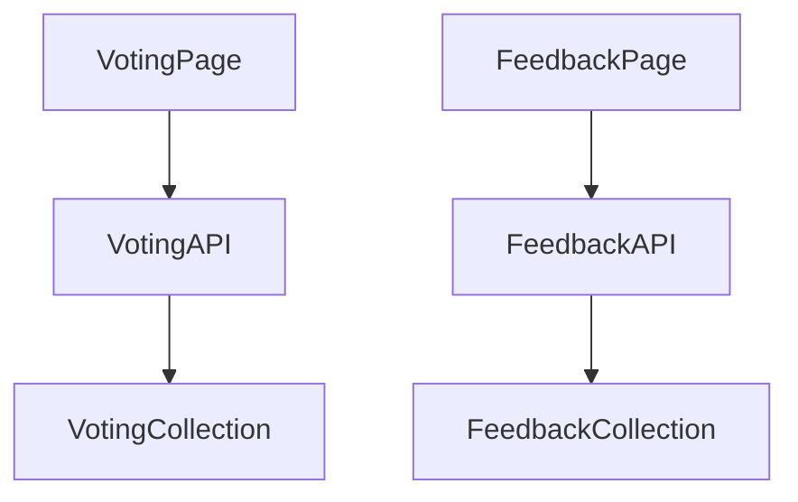

---

### **API Layer Components**

#### a. **Authentication API**

**Purpose**: Validates user credentials and manages JWT tokens.

**Endpoints**:
- `/login`: Authenticates and issues JWT
- `/logout`: Invalidates JWT

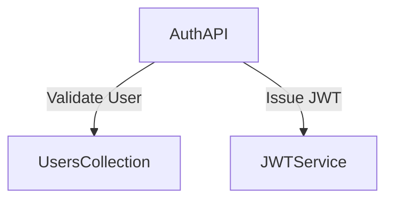

---

#### b. **User Management API**

**Purpose**: Handles CRUD operations for users and roles.

**Endpoints**:
- `/users`: Create, Read, Update, Delete users
- `/users/role`: Assign roles

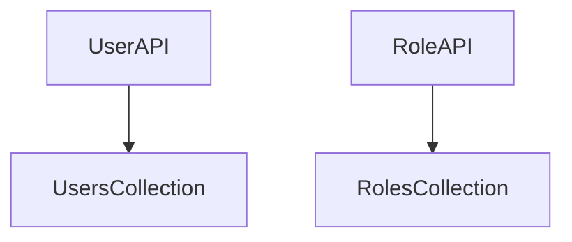

---

#### c. **Class and Notice API**

**Purpose**: Manages classes and class-specific notices.

**Endpoints**:
- `/classes`: CRUD for class entities
- `/notices`: CRUD for notices

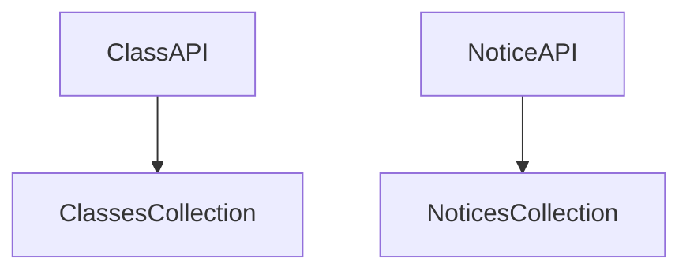

---

#### d. **File API**

**Purpose**: Handles file uploads for class materials.

**Endpoints**:
- `/upload`: Upload files to GCS/AWS S3
- `/download`: Retrieve files

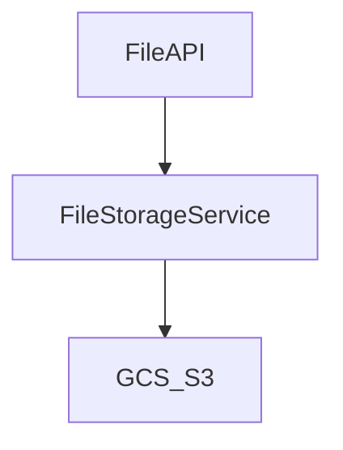

---

#### e. **Attendance API**

**Purpose**: Manages attendance tracking and alerts.

**Endpoints**:
- `/attendance`: Track and alert based on attendance records

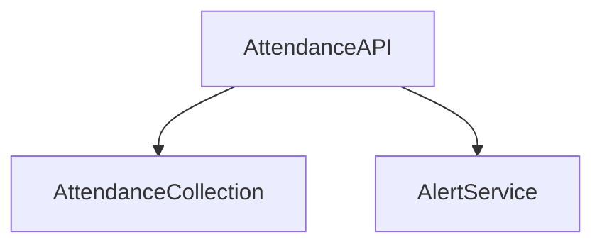

---

#### f. **Voting and Feedback API**

**Purpose**: Conducts voting and collects feedback.

**Endpoints**:
- `/vote`: Submit votes
- `/feedback`: Submit feedback

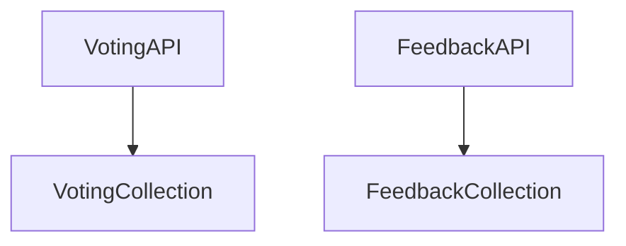

---

### **Database Layer Components**

#### MongoDB Collections

**Purpose**: Stores application data, organized by entities.

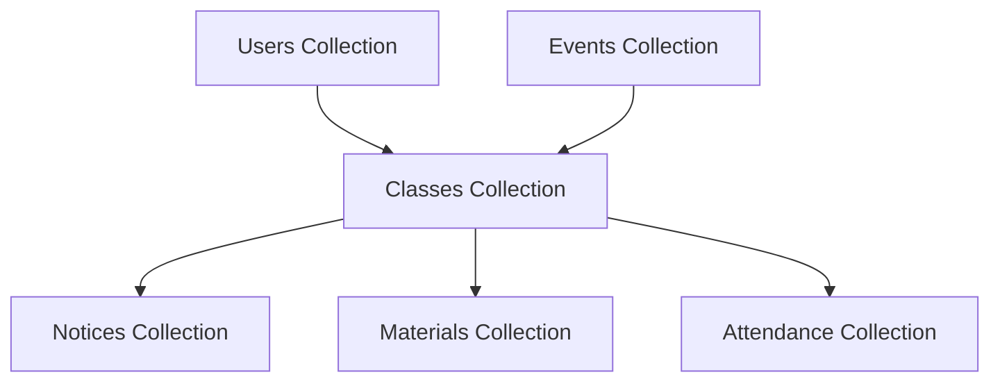

---

### **External Services**

#### JWT for Authentication

**Purpose**: Manages session tokens for authentication.

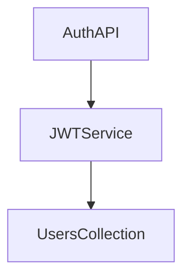

#### File Storage

**Purpose**: Stores uploaded files in cloud storage.

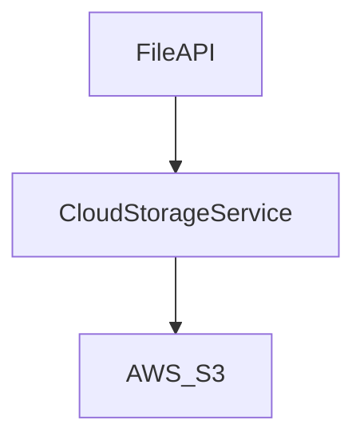

#### Push Notifications

**Purpose**: Sends notifications for important updates.

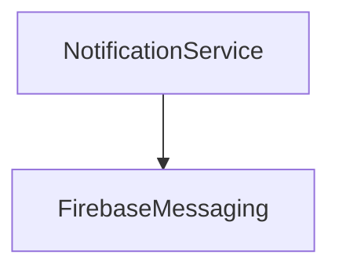


