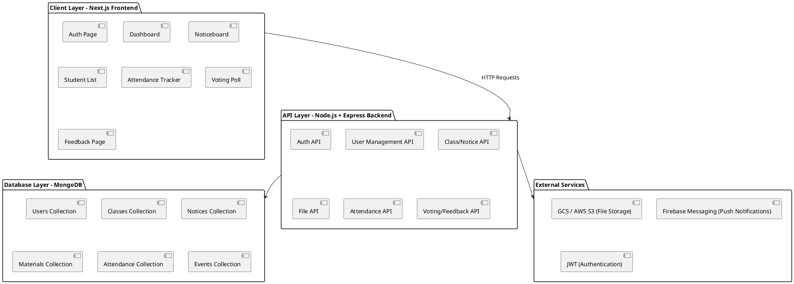
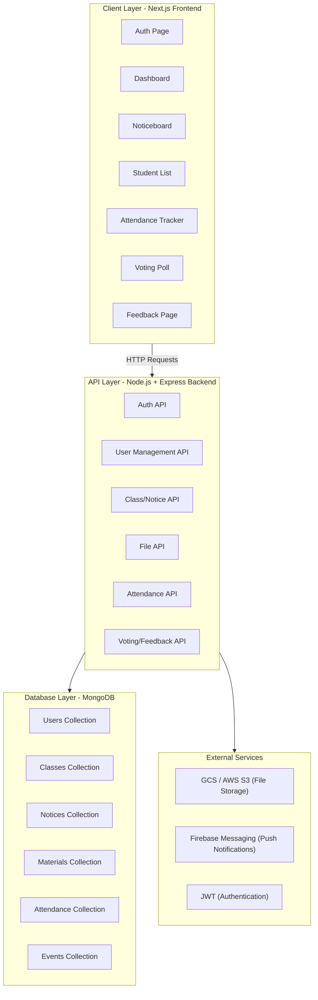
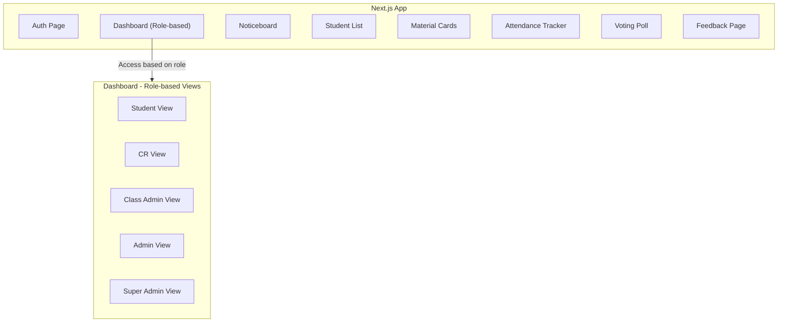

# Designs

```
class-management-system/
├── public/                     # Public assets, including icons and images
├── src/
│   ├── components/             # Reusable components for UI elements
│   │   ├── Navbar.js           # Navbar for navigation across roles
│   │   ├── Footer.js           # Footer for common information
│   │   ├── Noticeboard.js      # Noticeboard component
│   │   ├── StudentList.js      # Student list display
│   │   ├── MaterialCard.js     # Class material and photos display
│   │   ├── AttendanceTracker.js# Auto Attendance feature
│   │   └── VotingPoll.js       # Poll/Voting UI
│   │
│   ├── pages/                  # Next.js pages
│   │   ├── _app.js             # Custom App component for global styles
│   │   ├── index.js            # Homepage with login options and announcements
│   │   ├── dashboard/          # Role-specific dashboards
│   │   │   ├── admin.js        # Admin dashboard
│   │   │   ├── superAdmin.js   # Super Admin dashboard
│   │   │   ├── student.js      # Student dashboard
│   │   │   ├── cr.js           # Class Representative dashboard
│   │   │   └── ca.js           # Class Administrator dashboard
│   │   ├── auth/               # Authentication pages
│   │   │   ├── login.js        # Login page
│   │   │   └── register.js     # Registration page
│   │   ├── settings/           # User settings pages
│   │   ├── events/             # Events, hackathons, and timeline pages
│   │   └── feedback.js         # Feedback form
│   │
│   ├── services/               # API call wrappers
│   │   ├── authService.js      # Authentication API
│   │   ├── userService.js      # User role management API
│   │   ├── classService.js     # Class data API
│   │   └── fileService.js      # File handling API
│   │
│   ├── store/                  # State management (optional)
│   │   └── store.js            # Redux or Zustand setup for global state
│   │
│   └── styles/                 # CSS/SCSS modules
│       ├── globals.css         # Global styles
│       └── dashboard.module.css# Styles specific to dashboards
│
├── .env.local                  # Environment variables for sensitive data
├── next.config.js              # Next.js configuration for PWA and other settings
└── package.json
```
## High Level App Design 



### Mermaid





