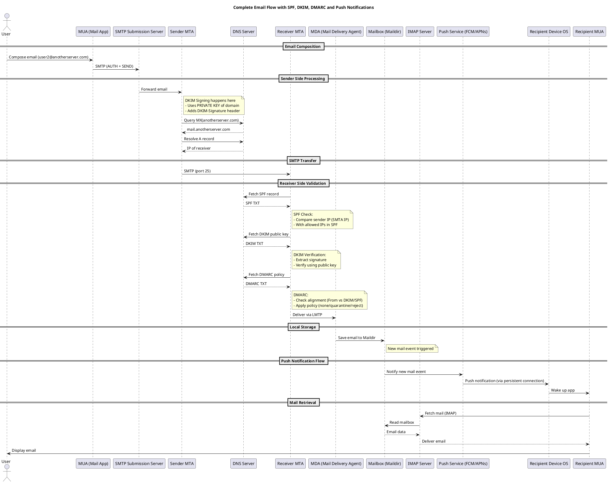

## Complete Flow Diagram

```plantuml
@startuml
title Complete Email Flow with SPF, DKIM, DMARC and Push Notifications

actor User
participant "MUA (Mail App)" as MUA
participant "SMTP Submission Server" as SUBMIT
participant "Sender MTA" as SMTA
participant "DNS Server" as DNS
participant "Receiver MTA" as RMTA
participant "MDA (Mail Delivery Agent)" as MDA
participant "Mailbox (Maildir)" as STORE
participant "IMAP Server" as IMAP
participant "Push Service (FCM/APNs)" as PUSH
participant "Recipient Device OS" as OS
participant "Recipient MUA" as RMUA

== Email Composition ==
User -> MUA : Compose email (user2@anotherserver.com)
MUA -> SUBMIT : SMTP (AUTH + SEND)

== Sender Side Processing ==
SUBMIT -> SMTA : Forward email

note right of SMTA
DKIM Signing happens here
- Uses PRIVATE KEY of domain
- Adds DKIM-Signature header
end note

SMTA -> DNS : Query MX(anotherserver.com)
DNS --> SMTA : mail.anotherserver.com

SMTA -> DNS : Resolve A record
DNS --> SMTA : IP of receiver

== SMTP Transfer ==
SMTA -> RMTA : SMTP (port 25)

== Receiver Side Validation ==
RMTA -> DNS : Fetch SPF record
DNS --> RMTA : SPF TXT

note right of RMTA
SPF Check:
- Compare sender IP (SMTA IP)
- With allowed IPs in SPF
end note

RMTA -> DNS : Fetch DKIM public key
DNS --> RMTA : DKIM TXT

note right of RMTA
DKIM Verification:
- Extract signature
- Verify using public key
end note

RMTA -> DNS : Fetch DMARC policy
DNS --> RMTA : DMARC TXT

note right of RMTA
DMARC:
- Check alignment (From vs DKIM/SPF)
- Apply policy (none/quarantine/reject)
end note

RMTA -> MDA : Deliver via LMTP

== Local Storage ==
MDA -> STORE : Save email to Maildir

note right of STORE
New mail event triggered
end note

== Push Notification Flow ==
STORE -> PUSH : Notify new mail event
PUSH -> OS : Push notification (via persistent connection)
OS -> RMUA : Wake up app

== Mail Retrieval ==
RMUA -> IMAP : Fetch mail (IMAP)
IMAP -> STORE : Read mailbox
STORE --> IMAP : Email data
IMAP --> RMUA : Deliver email

RMUA -> User : Display email

@enduml
```
