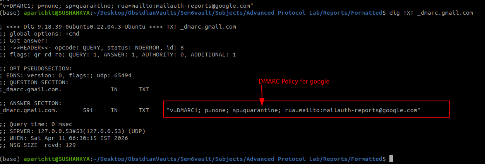

## Random Practical Snapshots

**Checkig the SPF Record of gmail.com**


- found that gmail.com delegetaes spf records to different doamin `_spf.googel.com`

**Checking the txt record `_spf.google.com`**

- found actual ip ranges which is allowed to send email from the behalf of gmail.com


**Checking the DMARC policy of gmail**
```bash
dig TXT _dmarc.gmail.com
```
