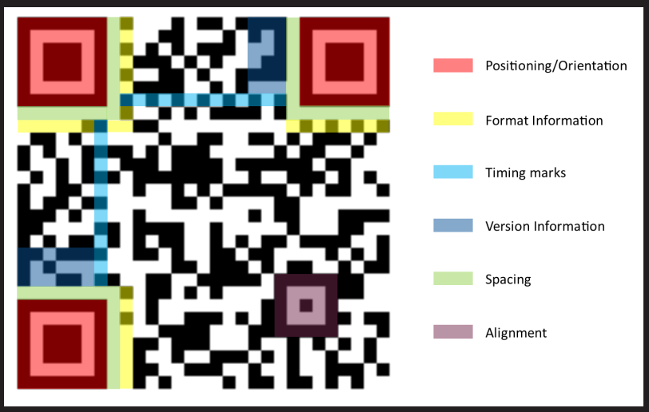

# QR codes

- The information density of a QR code is much higher than a vanilla barcode; depending on the format used and the resolution of reader, over a thousand bytes can be encoded in a region the size of a postage stamp.
- QR codes use a [Reed–Solomon error correction](http://en.wikipedia.org/wiki/Reed–Solomon_error_correction) based technology to help recover from errors in reading (for instance, caused by a smudge, badly printed code or other deformity).

​	